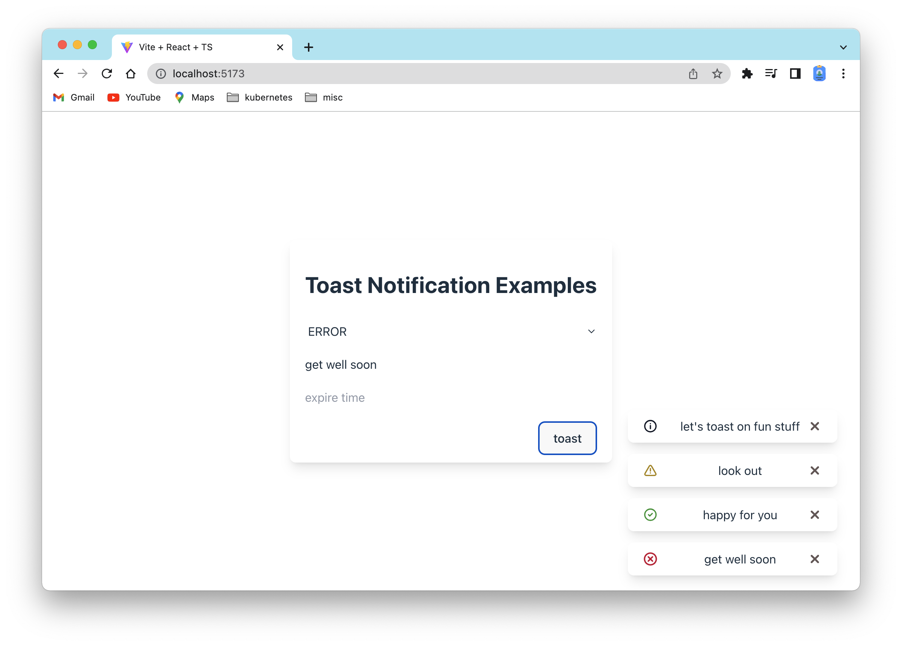

# introduction

Make `useToast(...)` hook to use with toast components `<Toast .../>`, toast provider `<ToastProvider .../>`, and toast context `ToastContext` .



# coding

1. Add the ToastProvider and use the 
   ```
   // main.tsx
   ReactDOM.createRoot(document.getElementById('root') as HTMLElement).render(
     <React.StrictMode>
       <ToastProvider position="bottom-right"> {/* <--- here */}
         <App />
       </ToastProvider>
     </React.StrictMode>,
   );
   ```
1. Add the ToastInput Example (Provider....)
   ```
   // App.tsx
   import './App.css';
   import { ToastInput, ToastInputProvider } from './ToastInput';
   
   export const App = (): JSX.Element => {
     return (
       <ToastInputProvider>                 {/* <--- here */}
         <ToastInput />                     {/* <--- here */}
       </ToastInputProvider>
     );
   };
   ```
1. call addToast to add toast
   ```
   // ToastInput.tsx
   export const ToastInput = (): JSX.Element => {
     const toastContext = useContext(ToastContext);
     const { addToast } = toastContext;
       
     return (
       <div>
           ...
           <button
               onClick={() => {
                    addToast({             // <--- here
                        id: uuidv4(), 
                        title, 
                        status, 
                         expire,
                    });
               }}
             >
               toast
           </button>
       </div>
     );
   }
   ```